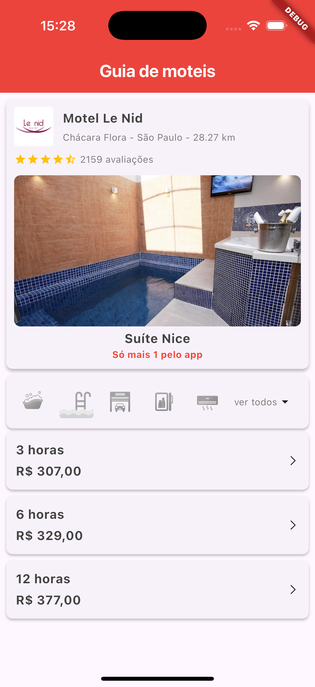

# guia_moteis

A new Flutter project.

## Getting Started

This project is a starting point for a Flutter application.

A few resources to get you started if this is your first Flutter project:

- [Lab: Write your first Flutter app](https://docs.flutter.dev/get-started/codelab)
- [Cookbook: Useful Flutter samples](https://docs.flutter.dev/cookbook)

For help getting started with Flutter development, view the
[online documentation](https://docs.flutter.dev/), which offers tutorials,
samples, guidance on mobile development, and a full API reference.

## Visão Geral do Projeto

Este projeto utiliza boas práticas da Clean Architecture para garantir manutenibilidade e escalabilidade. 
Além disso, o estado da aplicação é gerenciado com RiverPod. As responsabilidades estão bem separadas entre camadas, facilitando testes e a evolução da aplicação.

## Funcionalidades e Métodos Utilizados

### 1. Exibir Slide das Suítes
- Responsabilidade: Apresentar um carrossel visual das suítes disponíveis.
- Métodos: Implementação de widget responsivo que utiliza injeção de dependência para gerenciamento de estado.
- Benefícios: Melhora a experiência do usuário e facilita a apresentação dos dados.

### 2. Exibir Vagas Disponíveis
- Responsabilidade: Listar as vagas disponíveis para locação.
- Métodos: Uso de serviços de consulta que segregam regras de negócio da camada de apresentação.
- Benefícios: Garante dados atualizados e confiáveis com um padrão de consulta.

### 3. Exibir Valores por Hora
- Responsabilidade: Mostrar o valor da diária convertido para valores por hora.
- Métodos: Cálculos realizados na camada de domínio com regras de negócio bem definidas, utilizando repositórios para acesso aos dados.
- Benefícios: Proporciona flexibilidade para o usuário visualizar opções de quanto custa por hora.

### 4. Exibir Valores com Descontos
- Responsabilidade: Apresentar os valores considerando descontos já aplicados.
- Métodos: Cálculo de descontos implementado em UseCases, garantindo a separação de regras de negócio.
- Benefícios: Ajuda o usuário a perceber a economia e incentiva a conversão.

### 5. Exibir Porcentagem de Desconto
- Responsabilidade: Informar a porcentagem de desconto aplicada nos valores.
- Métodos: Processamento matemático isolado em funções puras na camada de domínio.
- Benefícios: Transparência e clareza para o usuário, reforçando a credibilidade dos dados.

## Arquitetura Limpa Aplicada

- Separação de camadas: apresentação, domínio e dados.
- Injeção de dependências para desacoplamento entre componentes.
- Uso de UseCases e Repositórios para isolamento de regras de negócio.
- Testabilidade e manutenção facilitadas através do isolamento de responsabilidades.

## Screenshots

Para visualizar a interface do aplicativo, confira os screenshots abaixo:

